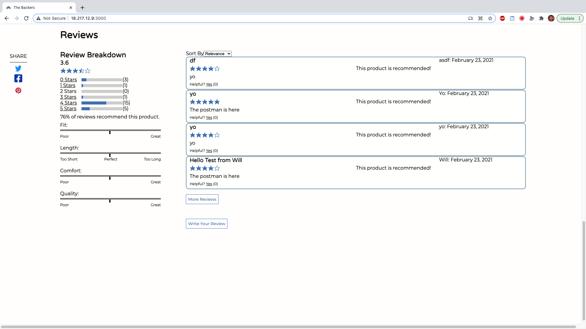
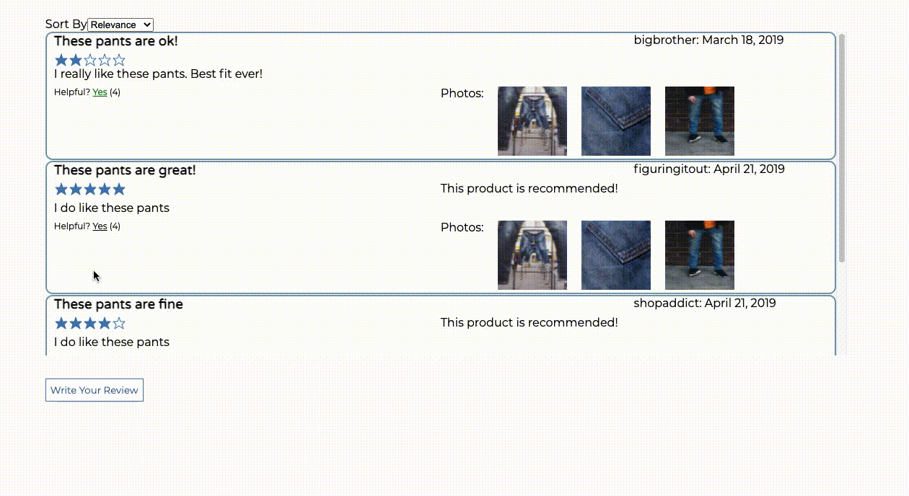
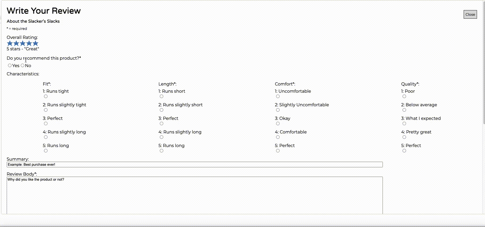

# FEC
Front End Capstone project

# Reviews Documentation
---
### Intro
This component was built using the business requirements document as well as the design mockup provided. All of the components were built from scratch using react and css styling.

This section uses mostly react class components to store local states that affect a components content and styles. Eventually, these class components will be refactored out in favor of more redux containers and functional components utilizing react hooks.

---

### Reviews Breakdown
As per the business requirements doc, this section takes the meta data for a product's reviews and displays the...

- overall average rating
- % of users that recommended the product
- number of reviews for each rating
- consumer feedback on a product's qualities (if applicable)

This section can also filter the reviews list based on the star ratings selected here.

### Reviews List
The business requirements doc requested that the reviews list display a...

- default of two reviews loaded on the list
- dropdown menu that gives different sort options
- "more reviews" button that loads up to two more reviews
- "write a review" button that opens the window to write a new review

This list is composed of review entries that each include a...

- star rating
- summary for the review
- nickname for the user who posted the review
- main review body
- date for when the review was posted
- indication that the user recommended the product
- button to mark the review as 'helpful'
- photos posted by the user to include in the review (if applicable)
- response to the review by the seller (if applicable)

### Add Review Form
This form follows the business requirements doc's guidelines, allowing users to input a...

- Overall rating of the product (required)
- Rating for each characteristic applicable to the product (required)
- Summary of their thoughts (maximum of 60 characters)
- Main review body (required, minimum of 50 characters, maximum of 1000 characters)
	- Indicator of how many more characters are needed to reach the character minimum
- Photos related to the review
- Nickname (required, maximum of 60 characters)
- Email address (required, maximum of 60 characters)
- Submit button

> Carousel Demonstration
> 
